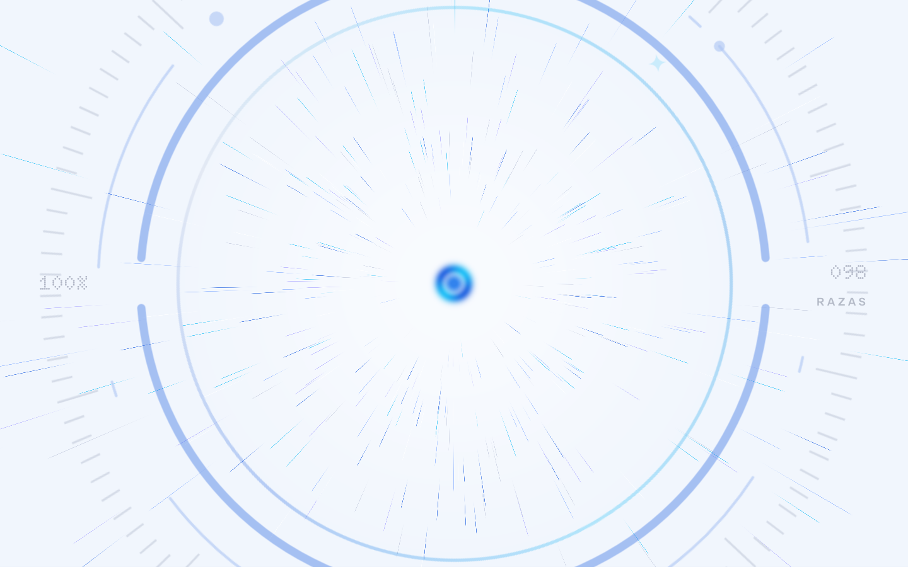
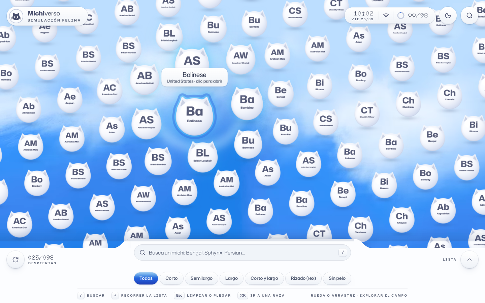
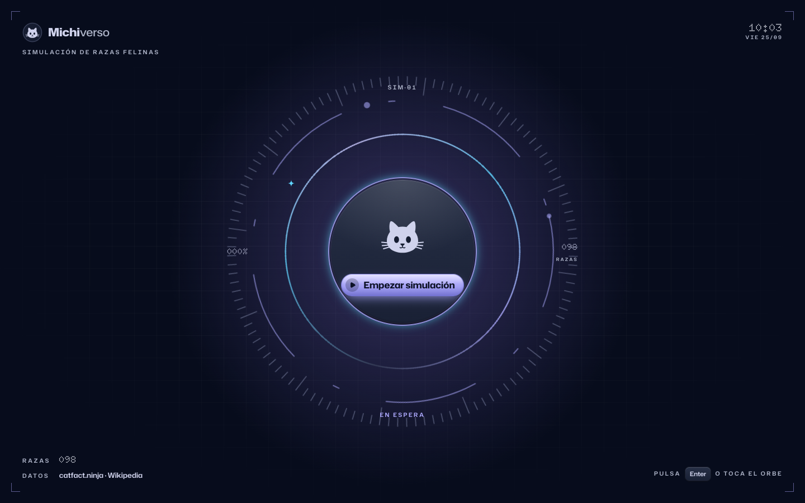

# Michiverso

Directorio de razas de gato sobre la API pública de [catfact.ninja](https://catfact.ninja/), presentado como el menú de una consola: una pantalla de inicio, un campo infinito de orbes con forma de gato y un dispositivo de bolsillo, el Ronrón, con la ficha de cada raza. Prueba técnica de Frontend para Nextep Innovation.

**Stack:** Next.js 16 (App Router) · React 19 · TypeScript estricto · TanStack Query + Zustand · Zod · Three.js + GSAP · Tailwind CSS 4 · Vitest.


## Cómo ejecutarlo

Requisitos: Node.js 20.9 o superior y npm.

```bash
npm install
npm run dev          # desarrollo en http://localhost:3000
```

Build de producción (con el que se midió Lighthouse):

```bash
npm run build
npm start            # http://localhost:3000
```

| Script | Qué hace |
| --- | --- |
| `npm test` | Pruebas unitarias (Vitest) |
| `npm run typecheck` | `tsc --noEmit` |
| `npm run lint` | ESLint, incluidas las reglas que protegen las fronteras de la arquitectura |
| `npm run check` | Las tres anteriores |
| `npm run lighthouse` | Audita Home y Detalle (móvil y escritorio) contra el build en marcha. Ver [Auditoría Lighthouse](#auditoría-lighthouse) |
| `npm run analyze` | Build con `@next/bundle-analyzer` |

No hace falta ninguna variable de entorno. Opcionales: `NEXT_PUBLIC_SITE_URL` (URL canónica para metadatos y sitemap) y `NEXT_PUBLIC_CATFACT_BASE_URL` (por defecto `https://catfact.ninja`).

## Cómo se usa

1. **Inicio.** El HUD de una consola en espera: rejilla de plano, esquinas con lecturas (marca, hora LCD, fuentes de datos) y en el centro una retícula que gira alrededor de un disco de perla con el gato: el botón "Empezar simulación". Al pulsarlo, el disco se hunde y rebota, salen destellos y la retícula acelera; el disco pasa a marcar el porcentaje de carga y cuatro arcos se encienden, uno por paso real (motor, cielo, razas, orbes), mientras trazos de luz WebGL cruzan la pantalla. Al terminar, la retícula se atraviesa y el velo se abre como un iris desde el centro, con un borde iridiscente, sobre el cielo y los orbes; la barra y la consola se montan después. Cada vez que entras (o recargas) empiezas aquí; dentro de la visita, volver de una ficha al campo no repite la entrada.
2. **El campo.** Cada raza es un orbe con orejitas de gato y su monograma: de perla de día, lavanda de noche. El orbe señalado lleva un marco azul que late, como la selección del menú de una consola. Las filas se deslizan en diagonal sin fin. Al pasar el puntero, los orbes cercanos se agrandan como bajo una lupa y el resto sigue su curso. La rueda o el arrastre aceleran el viaje, y viajar despierta la página siguiente de la API.
3. **La consola de abajo.** Buscador, filtros de pelaje, contador y la lista completa, virtualizada y con scroll infinito.
4. **El Ronrón.** Pulsar un orbe (o una fila) abre la ficha en una consola de bolsillo de dos piezas, como una DS: nace cerrada en el orbe, viaja al centro, la tapa se abre en 3D sobre su bisagra y las pantallas se encienden como un tubo. En la tapa, la foto y la pantalla de datos (ficha, historia, familia); en la base, la cruceta, la pantalla del dato curioso y los botones A/B, cada uno en su pista (nada se pisa a ningún ancho). Las orejas y los gatillos L/R flotan sueltos sobre la tapa. Los controles funcionan de verdad y tienen atajos de teclado. La foto se ve siempre completa y de borde a borde: nunca se recorta ni deja franjas, porque el hueco lo rellena la propia foto desenfocada.

La interfaz suena (sonidos sintetizados, sin archivos) desde la primera pulsación, que es cuando el navegador lo permite. No hay interruptor: el sonido es parte de la consola.

**Tema.** Claro por defecto. El botón del sol y la luna, en la barra de arriba, pasa a la noche con una ola de luz que nace del botón, tapa la pantalla con el color del otro tema y se disuelve sobre él: cielo nocturno en video, orbes lavanda con halo y estrellas, plástico índigo y teclas de gel lavanda. La elección se recuerda en el navegador; el sistema operativo no decide.

**Estética.** Consola de bolsillo blanca y futurismo Y2K, con esquinas continuas a la manera de Apple: plástico perla mate (sin metal), botones de gel azul con reflejo de burbuja, destellos de cuatro puntas, rótulos de HUD y lecturas LCD de matriz de puntos. Una sola tipografía, **Hubot Sans** (grotesca de esquinas redondeadas, entre robot y juguete), y **Doto** solo para las cifras de LCD.

| Inicio | El iris se abre |
| --- | --- |
|  |  |


| La tapa se abre | Lupa sobre el campo |
| --- | --- |
|  |  |

| De noche: el inicio | De noche: el Ronrón |
| --- | --- |
|  |  |

## Requisitos de la prueba

**Listado de razas (`/`)**

| Requisito | Cómo se cumple |
| --- | --- |
| Raza y país de cada entrada | Cada orbe lleva el monograma y el nombre; al señalarlo, una etiqueta muestra nombre y país. La lista de la consola los muestra en texto. |
| Infinite scroll obligatorio | En la lista, la página siguiente se pide a 5 filas del final. En el campo, viajar ~2400 px (rueda o arrastre) despierta la página siguiente. |
| Pull-to-refresh o recarga | Botón redondo de recarga en la consola y gesto de tirar para recargar en táctil. Lo cargado no se pierde hasta que llega la página nueva. |
| Búsqueda local con debounce | 300 ms, sin acentos ni mayúsculas, sobre lo cargado. Los orbes que no coinciden se desvanecen en el campo. Con la búsqueda activa, el scroll infinito se pausa y se ofrece "Despertar 25 más". |
| Estado en la URL | `?q=`, `?pelaje=` y `?page=` (la página que ocupa la parte alta de la lista). Se comparte y sobrevive a F5. |
| Primera página en el servidor | La home se renderiza en el servidor con la primera página (o las que pida `?page=`) ya resuelta. El cliente hidrata React Query con esos datos, sin segunda petición. |
| Virtualización obligatoria | La lista usa `@tanstack/react-virtual`: con 98 razas o con 10 000 hay unas 11 filas en el DOM. El campo dibuja todos los orbes visibles en una sola llamada instanciada de WebGL. |

**Detalle (`/razas/[slug]`)**

| Requisito | Cómo se cumple |
| --- | --- |
| Breed, Country, Origin, Coat, Pattern | Pestaña "Ficha" del Ronrón. Los vacíos de la API se muestran como "Sin registrar". |
| Dato curioso aleatorio de `/fact` | Pantalla propia del Ronrón con su ciclo de carga independiente de la ficha. El botón A pide otro. |
| Carga independiente | La ficha llega generada en el build; el dato curioso tiene su propio skeleton, error y reintento. |

Además: foto y resumen de cada raza desde Wikipedia (ver [Datos de Wikipedia](#datos-de-wikipedia)), razas emparentadas, reparto de pelajes, raza anterior y siguiente, "Al azar" y compartir.

**Técnicos**

| Requisito | Cómo se cumple |
| --- | --- |
| Gestión de estado | React Query para estado de servidor y Zustand para estado de UI. Ver [Gestión de estado](#gestión-de-estado-react-query--zustand). |
| Arquitectura limpia | Hexagonal, con las fronteras comprobadas por ESLint. Ver [Arquitectura](#arquitectura). |
| Skeletons | Lista, dato curioso y pestaña Familia tienen skeleton. El campo tiene su pantalla de enlace con los pasos reales. |
| Toasts ante fallos de red | Avisos con sileo, arriba y bajo la barra de sistema: sin conexión, conexión restablecida, página que falla (con "Reintentar"), dato que falla. |
| Reintentos con backoff | Exponencial con jitter y límite, en el adaptador HTTP. Ver [Manejo de fallos](#manejo-de-fallos). |
| Tipado fuerte y Zod | TypeScript estricto. Toda respuesta de catfact.ninja y de Wikipedia se valida con Zod (`zod/mini`) antes de entrar al dominio. |
| Accesibilidad | Ver [Accesibilidad](#accesibilidad). |
| Lighthouse ≥ 90 en Home y Detalle | Ver [Auditoría Lighthouse](#auditoría-lighthouse). |

**Plus:** transiciones entre la lista y el detalle (el Ronrón nace del orbe o la fila pulsada y vuelve a él al cerrarse), copia local en localStorage de la primera página y service worker para abrir sin red, y 44 pruebas unitarias.

## Arquitectura

Hexagonal (puertos y adaptadores), con las dependencias apuntando siempre hacia dentro:

```
src/
├── domain/          Núcleo. TypeScript puro: Breed, slug, búsqueda, país, pelaje,
│                    perfil (foto + resumen), dato curioso.
├── application/     Casos de uso + puertos (interfaces) + contrato de errores.
├── infrastructure/  Adaptadores secundarios: HTTP a catfact.ninja y a Wikipedia,
│                    localStorage, y las raíces de composición (servidor y navegador).
└── presentation/    Adaptador primario: React (componentes, hooks, stores) y el
                     motor del campo en Three.js.
app/                 Rutas de Next: solo componen piezas de presentation/.
```

- El **dominio** no importa nada: ni React, ni Zod, ni casos de uso.
- La **aplicación** define lo que necesita (`BreedRepository`, `FactRepository`, `BreedProfileRepository`, `BreedSnapshotStore`, `Clock`) y los casos de uso trabajan contra esas interfaces.
- La **infraestructura** las implementa. Todo fallo sale como un `DataSourceError` tipado (`offline`, `timeout`, `server`, `rate-limited`, `invalid-response`…).
- Las fronteras no dependen de la disciplina: `eslint.config.mjs` rompe el lint si una capa importa de otra que no le toca.

Ejemplo del porqué: la API no tiene endpoint por raza. Encontrar una por su slug es lógica de aplicación (`getBreedDossier` recorre las páginas), no del adaptador HTTP. En las pruebas ese caso de uso corre contra un repositorio en memoria. Y cuando hizo falta añadir fotos, bastó un puerto nuevo (`BreedProfileRepository`) y su adaptador de Wikipedia: ningún componente sabe de dónde salen.

Más detalle, con el flujo de datos y cada decisión, en [ARCHITECTURE.md](ARCHITECTURE.md).

### Gestión de estado: React Query + Zustand

Son dos tipos de estado distintos, así que cada uno tiene su herramienta:

- **Estado de servidor → TanStack Query.** Las páginas del directorio son una `useInfiniteQuery` hidratada con lo que resolvió el servidor, y el dato curioso es una `useQuery` aparte. Query aporta caché, deduplicación, estados de carga y error por consulta y, sobre todo, **pausa las peticiones sin red y las reanuda solas al volver** (`networkMode: "online"`). La paleta ⌘K reutiliza la misma consulta que la lista.
- **Estado de UI → Zustand.** La fase de la simulación (inicio, enlace, en marcha), el estado de conexión ("reintentando 2 de 3"), el Ronrón abierto, las razas descubiertas (persistidas) y la navegación. Son stores pequeños, sin provider, y legibles desde fuera de React: el cliente HTTP avisa de cada reintento sin conocer la UI, y el motor de Three.js recibe el estado sin re-renderizar.
- **La URL** es la fuente de verdad de `q`, `pelaje` y `page`. Se escribe con `history.replaceState`, que el App Router sincroniza con `useSearchParams` sin volver a pedir la página al servidor en cada tecla.

Redux Toolkit habría resuelto lo mismo con más ceremonia. Aquí no hay flujos de escritura complejos que justifiquen reducers y acciones.

### Estrategia de renderizado

| Ruta | Estrategia | Por qué |
| --- | --- | --- |
| `/` | SSR dinámico con caché de datos (`fetch` con `revalidate: 3600`) | Lee `?page=` y `?q=` para devolver la lista correcta desde el primer byte (la pantalla de inicio va siempre delante). Cada página de la API sale de la caché de datos de Next, así que el render no espera a la API. |
| `/razas/[slug]` | SSG de las 98 razas en el build + ISR cada hora + `dynamicParams` | La ficha es estática y se sirve al instante. Una raza nueva se genera en su primera visita. Si la API cae durante el build, el build no falla: las fichas se generan bajo demanda. |
| `@modal/(.)razas/[slug]` | Ruta interceptada | Al navegar desde el campo, el Ronrón se abre como modal encima de los orbes, pero la URL es la de la ficha: se comparte, "atrás" lo cierra y F5 abre la página completa. |
| Dato curioso, páginas 2+ | Cliente | El dato tiene que ser aleatorio en cada visita (en el HTML quedaría congelado) y el infinite scroll es client-side por requisito. |

### Datos de Wikipedia

La API de razas no tiene fotos. El adaptador `infrastructure/wikipedia` las toma de la API de MediaWiki en el build: busca el artículo de cada raza ("Bengal cat", "Bengal (cat)", "Bengal"), acepta solo artículos que se describen como gato o raza, y trae la foto principal y un resumen en español cuando existe (si no, en inglés, y lo dice). Todo por lotes y en serie: unas diez peticiones para las 98 razas, cacheadas un día. Si Wikipedia no responde, la ficha sale igual, con el monograma en lugar de la foto.

Las fotos pasan por el optimizador de imágenes de Next (AVIF/WebP al tamaño del visor), que guarda cada una un mes: el servidor de imágenes de Wikimedia limita las ráfagas con un 429, así que cada foto se le pide una sola vez. Si aun así una no llega, se muestra el monograma de la raza, nunca un icono de imagen rota.

## Manejo de fallos

La regla: **nunca perder lo que el usuario ya tiene en pantalla y decir siempre qué pasa**.

| Situación | Qué ocurre |
| --- | --- |
| Fallo intermitente (red, timeout, 5xx, 429) | El cliente HTTP reintenta con **backoff exponencial y jitter**: hasta 3 reintentos (en el navegador, esperas de hasta 0,6 s, 1,2 s y 2,4 s). Respeta `Retry-After` en los 429. La barra de sistema muestra el intento en curso. Los 4xx y las respuestas con forma inválida no se reintentan. |
| Se agotan los reintentos | Bloque de error al final de la lista con "Reintentar" y un aviso con la misma acción. Lo ya cargado sigue ahí. |
| El navegador pierde la conexión | Aviso persistente y el icono de red de la barra en rojo; al volver la red, el aviso se transforma en "Conexión restablecida". La página siguiente queda **en pausa**, no en error, y se reanuda sola. |
| La API cae durante el SSR | La página se entrega igual. El cliente reintenta desde el navegador y, mientras tanto, muestra la **copia local** de la primera página si existe. |
| Abrir la app sin red | El service worker sirve la última copia del HTML (que ya trae la primera página) y los assets. |
| Una fila de la API viene rota | Se descarta esa fila (validación Zod por fila); el resto de la página se muestra. |
| El navegador no tiene WebGL | La simulación pasa a "modo consola": la lista y el Ronrón funcionan igual, sin el campo. |
| Una librería diferida no se puede descargar | El componente se queda en su versión básica (texto plano, botón sin tooltip, sin animación) y reintenta al volver la red. Nunca rompe el render. |

| Sin conexión | API caída tras los reintentos |
| --- | --- |
|  |  |

## Accesibilidad

- **El campo es decorativo para el lector de pantalla** (`aria-hidden`): todo lo que hace tiene su equivalente accesible en la consola (lista, buscador, filtros) y en la paleta ⌘K.
- **Lista virtualizada:** `aria-setsize` y `aria-posinset`, para que el lector anuncie "13 de 98" aunque solo existan 11 filas en el DOM. Región `status` con el número de resultados.
- **Teclado:** `/` enfoca el buscador y `↓` pasa a la lista (un solo tabulador entra; dentro, flechas, Inicio, Fin, RePág y AvPág). `Esc` limpia o pliega. ⌘K abre la paleta. En el Ronrón: `←` `→` cambian de raza, `↑` `↓` de pestaña, A pide otro dato y B o `Esc` cierran. El diálogo atrapa el foco y lo devuelve al cerrar.
- Cada botón de icono tiene nombre accesible. Contraste AA medido en los dos temas, sobre la perla y sobre las pantallas (tabla en ARCHITECTURE.md §8). El foco es el marco de selección azul, separado de la pieza. Enlace para saltar al contenido. Con `prefers-reduced-motion` no hay video, el campo no se desliza y las animaciones se reducen a fundidos.

## Auditoría Lighthouse

Build de producción, Lighthouse 13 (CLI), cada auditoría corrida 5 veces con el servidor caliente (`RUNS=5 npm run lighthouse`). Se reporta la mediana.

| Página | Performance | Accessibility | Best Practices | SEO |
| --- | --- | --- | --- | --- |
| Home · móvil | **90** | **100** | **100** | **100** |
| Detalle · móvil | **91** | **100** | **100** | **100** |
| Home · escritorio | **100** | **100** | **100** | **100** |
| Detalle · escritorio | **100** | **100** | **100** | **100** |

| Home · móvil | Detalle · móvil |
| --- | --- |
|  |  |

Los reportes completos están en [`docs/lighthouse/`](docs/lighthouse/): JSON y HTML de cada página y formato, más `summary.json` con las cinco corridas.

Todas las métricas llegan a 90. La de menos margen es **Performance en móvil**: Lighthouse simula un móvil de gama media con la CPU 4 veces más lenta, y el campo de orbes es una experiencia WebGL. Lo que la sostiene:

- **Nada de lo que no se ve en el primer pintado viaja con la página.** El motor del campo (Three.js, ~170 KB) se pide al acercar el puntero al botón de inicio y termina de cargar durante el túnel, que es literalmente la pantalla de carga. GSAP llega con la primera interacción. El cliente HTTP, Zod y los adaptadores se descargan la primera vez que hace falta una página nueva o un dato. Los avisos (sileo y motion), la paleta, los tooltips, el gráfico y el carrusel, al usarlos.
- **Hidratación por tandas.** Cada pieza grande está en su propio `<Suspense>` (nada suspende), así React cede el hilo entre una y otra.
- **Fuentes: 54 KB en total.** Hubot Sans sin el eje de anchura (48 KB; con él pesaba 93 KB y bajaba el móvil a 87) y Doto (6 KB) para el LCD. Una segunda familia de texto (40 KB más) también costaba dos puntos: la interfaz usa solo Hubot.
- **Lo que no se ve no compite con la foto.** En una ficha abierta desde un enlace, el video del cielo (85 KB con su póster) y el dato curioso (con el cliente HTTP que lo trae) esperan a que la página termine de cargar y el navegador quede ocioso.
- **CSS del primer pintado: 17 KB** (gzip, con los dos temas). El relleno desenfocado de las fotos es una miniatura de 16 px (menos de 1 KB).

Nota para reproducir: las cifras de móvil dependen de la carga del equipo. Con el editor, un navegador y aplicaciones de chat abiertos (carga media de 6 a 8 en un Intel i9 de 8 núcleos), la misma build dio corridas sueltas de 71 a 92; las medianas de cinco fueron estables. El script calienta cada ruta y toma la mediana; para comparar, cerrar aplicaciones pesadas o subir `RUNS`. En escritorio es 99-100 de forma estable.

## Capturas

| | |
| --- | --- |
|  |  |
| El enlace: porcentaje y arcos por paso real de carga | Búsqueda: la lista filtra y el campo resalta las coincidencias |
|  |  |
| Historia, desde Wikipedia | Familia: emparentadas y reparto de pelajes |
|  |  |
| Paleta ⌘K | Cambio de tema: la ola nace del botón |

<p>
  
  
  
</p>

## Pruebas

`npm test` corre 44 pruebas unitarias:

- **Dominio:** slug (incluidas ligaduras como "æ"), búsqueda sin acentos, parseo del país, familias de pelaje y razas emparentadas.
- **Casos de uso:** contra repositorios en memoria. Restaurar `?page=N` con techo, localizar una raza y sus vecinas entre páginas, caducidad de la copia local, y el filtro de datos curiosos aptos para toda la familia.
- **Infraestructura:** backoff exponencial con temporizadores falsos, `Retry-After`, límite de intentos, qué se reintenta y qué no. El repositorio de catfact con `fetch` simulado (mapeo, filas rotas, 503 intermitente, 429, respuesta inválida) y el de Wikipedia (candidatos de título, artículos que no son de gatos, resumen en español o inglés, peticiones por lotes).
- **Presentación:** debounce, estado de la URL, store de conexión, localStorage y el monograma de los orbes.

## Decisiones y límites conocidos

- **La API no expone ids** ni un endpoint por raza. El slug se deriva del nombre y el detalle se resuelve recorriendo las páginas en el servidor (cacheadas).
- **La búsqueda es local**, como pide el enunciado: filtra lo cargado y lo dice.
- **Los textos de la API están en inglés** y se muestran tal cual. La interfaz está en español. De los 306 datos curiosos, 7 son crudos para una app familiar (pieles, gatos que se comen…); si sale uno, se pide otro.
- **Tema claro por defecto, oscuro a elección.** El oscuro no sigue al sistema operativo: es una decisión del visitante, con su propio cielo, paleta del campo y materiales. Un script de una línea en el `<head>` (lo pinta el layout raíz, un componente de servidor) pone la clase antes del primer pintado, así que no hay parpadeo; el cielo que no se usa no descarga nada. (Antes lo hacía `next-themes`, cuyo `<script>` dentro de un componente de cliente provocaba el aviso de React 19 "Encountered a script tag while rendering React component" cuando el proveedor se volvía a montar.)
- **Animaciones solo en la GPU.** Todo lo que se mueve anima `transform`, `opacity` o `filter`, o vive en un shader. La única excepción es interna de sileo (el morph de la píldora de avisos al aparecer).
- **La pantalla de inicio siempre.** Entrar o recargar pasa por "Empezar simulación". Solo la navegación interna (cerrar una ficha) vuelve directo al campo.
- **Sonido siempre activo.** Es parte de la consola, no una opción. Los navegadores no dejan sonar nada antes de la primera pulsación o tecla, así que el motor de sonido se descarga en ese momento.
- **Sin despliegue público.** La app se evalúa con el build de producción local (`npm run build && npm start`).
