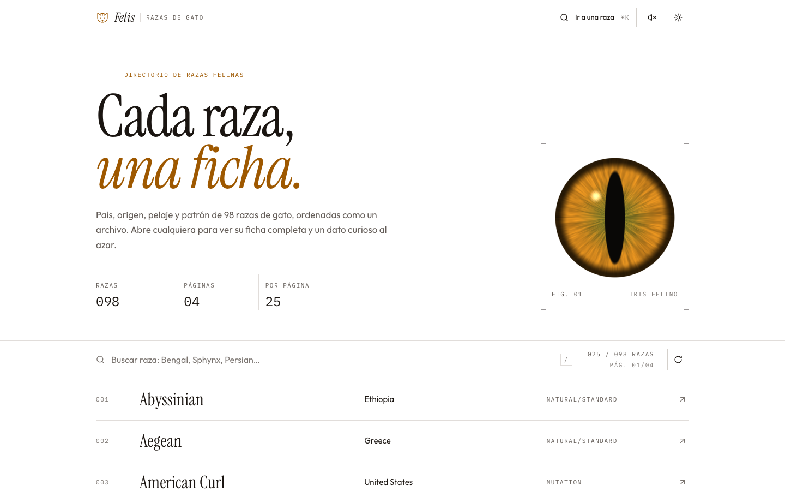
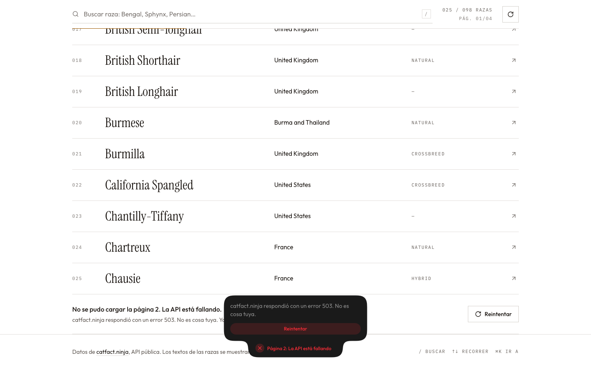
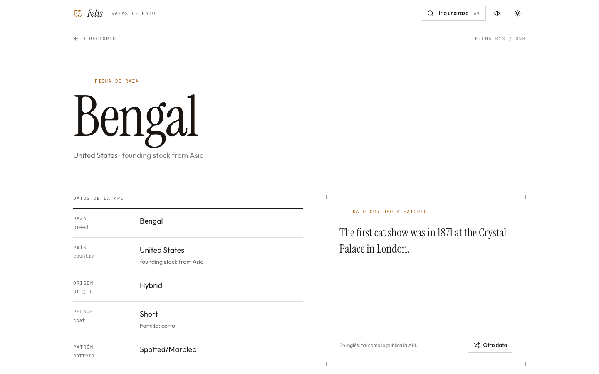
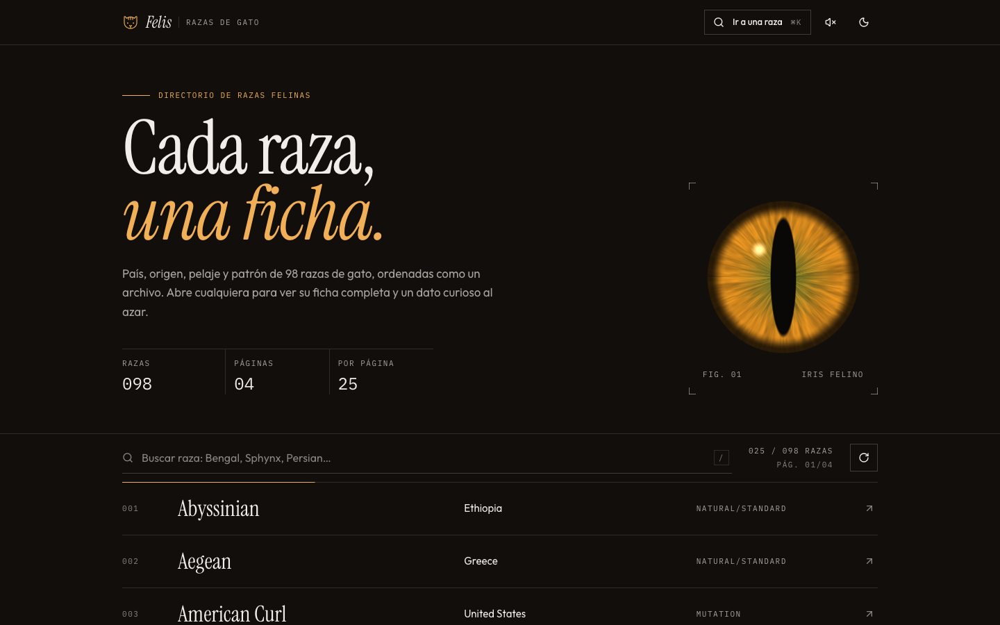
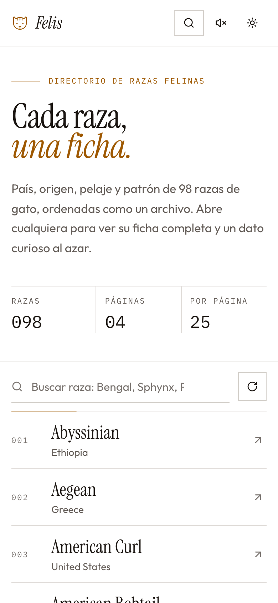
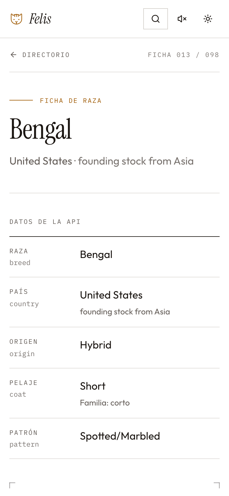

# cat-directory-app

Directorio interactivo de razas de gato sobre la API pública de [catfact.ninja](https://catfact.ninja/). Prueba técnica de Frontend para Nextep Innovation.

**Stack:** Next.js 16 (App Router) · React 19 · TypeScript estricto · TanStack Query + Zustand · Zod · Tailwind CSS 4 · Vitest.



## Cómo ejecutarlo

Requisitos: Node.js 20.9 o superior y npm.

```bash
npm install
npm run dev          # desarrollo en http://localhost:3000
```

Build de producción (es con el que se midió Lighthouse):

```bash
npm run build
npm start            # http://localhost:3000
```

Otros scripts:

| Script | Qué hace |
| --- | --- |
| `npm test` | Pruebas unitarias (Vitest) |
| `npm run typecheck` | `tsc --noEmit` |
| `npm run lint` | ESLint, incluidas las reglas que protegen las fronteras de la arquitectura |
| `npm run check` | Las tres anteriores |
| `npm run lighthouse` | Audita Home y Detalle (móvil y escritorio) contra el build en marcha. Ver [Auditoría Lighthouse](#auditoría-lighthouse) |
| `npm run analyze` | Build con `@next/bundle-analyzer` |

No hace falta ninguna variable de entorno. Opcionales: `NEXT_PUBLIC_SITE_URL` (URL canónica para metadatos y sitemap) y `NEXT_PUBLIC_CATFACT_BASE_URL` (por defecto `https://catfact.ninja`).

## Qué hace

**Directorio (`/`)**
- Lista de razas con nombre y país de origen, **virtualizada** con `@tanstack/react-virtual` sobre el scroll de la ventana: con 98 razas o con 10 000 hay unas 20 filas en el DOM.
- **Infinite scroll**: la página siguiente se pide cuando la última fila visible está a 6 del final.
- **Recargar desde la página 1**: botón en la barra y gesto de "tirar para recargar" en táctil. La lista actual no se toca hasta tener la página nueva, así que una recarga fallida no te deja sin nada.
- **Búsqueda local con debounce (300 ms)**, sin acentos ni mayúsculas, sobre lo ya cargado. Con la búsqueda activa, el scroll infinito se pausa y se ofrece "Cargar 25 más" para buscar en páginas siguientes.
- **Estado en la URL**: `?q=` y `?page=`. `page` es la página que ocupa la parte superior de la pantalla, así que un enlace compartido abre donde estabas.
- **Primer render en el servidor**: el HTML ya trae las filas. Con `?page=3` el servidor reconstruye las páginas 1 a 3 y el cliente se desplaza a la 3.

**Detalle (`/razas/[slug]`)**
- Breed, Country, Origin, Coat y Pattern. Los valores vacíos de la API se muestran como "Sin registrar".
- **Dato curioso aleatorio** desde `/fact`, con su propio estado de carga independiente de la ficha, y un botón "Otro dato".
- Además: razas emparentadas (mismo país o pelaje), un gráfico del pelaje en todo el directorio y navegación a la ficha anterior y siguiente.

**PLUS implementados:** modo oscuro que sigue al sistema (con selector manual), transición del nombre de la raza entre lista y detalle (View Transitions), copia local de la primera página y service worker para abrir sin red, 35 pruebas unitarias. También hay una paleta ⌘K para saltar a cualquier raza y sonidos de interfaz opcionales, apagados por defecto.

## Arquitectura

Hexagonal (puertos y adaptadores), con las dependencias apuntando siempre hacia dentro:

```
src/
├── domain/          Núcleo. TypeScript puro: Breed, slug, búsqueda, país, pelaje.
├── application/     Casos de uso + puertos (interfaces) + contrato de errores.
├── infrastructure/  Adaptadores secundarios: HTTP a catfact.ninja, localStorage,
│                    y las dos raíces de composición (servidor y navegador).
└── presentation/    Adaptador primario: React (componentes, hooks, stores).
app/                 Rutas de Next: solo componen piezas de presentation/.
```

- El **dominio** no importa nada: ni React, ni Zod, ni casos de uso.
- La **aplicación** define lo que necesita (`BreedRepository`, `FactRepository`, `BreedSnapshotStore`, `Clock`) y los casos de uso trabajan contra esas interfaces.
- La **infraestructura** las implementa. Toda respuesta de la API se valida con Zod antes de entrar al dominio, y todo fallo sale como un `DataSourceError` tipado (`offline`, `timeout`, `server`, `rate-limited`, `invalid-response`…).
- Las fronteras no dependen de la disciplina: `eslint.config.mjs` rompe el lint si una capa importa de otra que no le toca.

Ejemplo del porqué: la API no tiene endpoint por raza. Encontrar una por su slug es lógica de aplicación (`getBreedDossier` recorre las páginas), no del adaptador HTTP. En las pruebas ese caso de uso corre contra un repositorio en memoria.

Más detalle, con el flujo de datos y cada decisión, en [ARCHITECTURE.md](ARCHITECTURE.md).

### Gestión de estado: React Query + Zustand

Son dos tipos de estado distintos, así que cada uno tiene su herramienta:

- **Estado de servidor → TanStack Query.** Las páginas del directorio son una `useInfiniteQuery` hidratada con lo que resolvió el servidor, y el dato curioso es una `useQuery` aparte. Query aporta caché, deduplicación, estados de carga y error por consulta y, sobre todo, **pausa las peticiones sin red y las reanuda solas al volver** (`networkMode: "online"`). La paleta ⌘K reutiliza la misma consulta: si bajaste tres páginas, la paleta ya las tiene.
- **Estado de UI → Zustand.** El estado de conexión (online y "reintentando 2 de 3"), las preferencias persistidas (sonido) y la navegación (a qué vista del directorio vuelve "Directorio" y qué fila recupera el foco). Son stores pequeños, sin provider, y legibles desde fuera de React: el cliente HTTP avisa de cada reintento sin conocer la UI.
- **La URL** es la fuente de verdad de `q` y `page`. Se escribe con `history.replaceState`, que el App Router sincroniza con `useSearchParams` sin volver a pedir la página al servidor en cada tecla.

Redux Toolkit habría resuelto lo mismo con más ceremonia. Aquí no hay flujos de escritura complejos que justifiquen reducers y acciones.

### Estrategia de renderizado

| Ruta | Estrategia | Por qué |
| --- | --- | --- |
| `/` | SSR dinámico con caché de datos (`fetch` con `revalidate: 3600`) | Lee `?page=` y `?q=` para devolver la vista compartida desde el primer byte. Cada página de la API sale de la caché de datos de Next, así que el render no espera a la API. |
| `/razas/[slug]` | SSG de las 98 razas en el build + ISR cada hora + `dynamicParams` | La ficha es estática y se sirve al instante. Una raza nueva se genera en su primera visita. Si la API cae durante el build, el build no falla: las fichas se generan bajo demanda. |
| Dato curioso, páginas 2+ | Cliente | El dato tiene que ser aleatorio en cada visita (en el HTML quedaría congelado) y el infinite scroll es client-side por requisito. |

## Manejo de fallos

La regla: **nunca perder lo que el usuario ya tiene en pantalla y decir siempre qué pasa**.

| Situación | Qué ocurre |
| --- | --- |
| Fallo intermitente (red, timeout, 5xx, 429) | El cliente HTTP reintenta con **backoff exponencial y jitter**: hasta 3 reintentos en el navegador (esperas de hasta 0,6 s, 1,2 s y 2,4 s) y 2 en el servidor. Respeta `Retry-After` en los 429. La cabecera muestra "Reintentando 2/3". Los 4xx y las respuestas con forma inválida no se reintentan. |
| Se agotan los reintentos | Bloque de error al final de la lista con "Reintentar" y un toast (sileo) con la misma acción. Lo ya cargado sigue ahí. |
| El navegador pierde la conexión | Toast persistente y píldora "Sin conexión"; al volver la red, el mismo toast se transforma en "Conexión restablecida". La carga de la página siguiente queda **en pausa**, no en error, y se reanuda sola al volver la red. |
| La API cae durante el SSR | La página se entrega igual. El cliente reintenta desde el navegador y, mientras tanto, muestra la **copia local** de la primera página si existe. |
| Abrir la app sin red | El service worker sirve la última copia del HTML (que ya trae la primera página) y los assets. |
| Una fila de la API viene rota | Se descarta esa fila (validación Zod por fila); el resto de la página se muestra. |
| Una librería diferida no se puede descargar | El componente se queda en su versión básica (texto plano, botón sin tooltip) y reintenta al volver la red. Nunca rompe el render. |



Estos escenarios se verificaron en Chrome con Playwright: sin conexión y reconexión, API respondiendo 503 y recuperación.

## Accesibilidad

- **Lista virtualizada:** `role="list"` y `listitem` con `aria-setsize` y `aria-posinset`, para que el lector anuncie "13 de 98" aunque solo existan 20 filas en el DOM. `aria-busy` mientras carga.
- **Teclado:** `/` enfoca el buscador. `↓` pasa a la lista, donde un solo tabulador entra (tabindex itinerante). Dentro, `↑` `↓` `Inicio` `Fin` `RePág` `AvPág` recorren las filas y traen al DOM las que la virtualización no había montado. `↑` en la primera fila vuelve al buscador y `Esc` limpia la búsqueda. Al volver de una ficha, el foco regresa a su fila.
- Regiones `status` y `alert` para carga, resultados de búsqueda, reintentos y errores. Enlace para saltar al contenido. Contraste AA medido en ambos temas. Las animaciones respetan `prefers-reduced-motion`.

## Auditoría Lighthouse

Build de producción, Lighthouse 13 (CLI), cada auditoría corrida 3 veces. Se reporta la mediana.

| Página | Performance | Accessibility | Best Practices | SEO |
| --- | --- | --- | --- | --- |
| Home · móvil | **93** | **100** | **100** | **100** |
| Detalle · móvil | **92** | **100** | **100** | **100** |
| Home · escritorio | **100** | **100** | **100** | **100** |
| Detalle · escritorio | **100** | **100** | **100** | **100** |

| Home · móvil | Detalle · móvil |
| --- | --- |
|  |  |

Los reportes completos están en [`docs/lighthouse/`](docs/lighthouse/): JSON y HTML de cada página y formato, más `summary.json` con las tres corridas.

Todas las métricas superan 90. La que tiene menos margen es **Performance en móvil** (corridas entre 91 y 97). Lighthouse simula un móvil de gama media con la CPU 4 veces más lenta, y lo que pesa es el JS que React hidrata. Lo que ya se hizo:

- Todo lo que no hace falta para el primer pintado se descarga en ocioso o al primer uso: menú de tema y tooltips (Radix), toasts (sileo), paleta ⌘K (cmdk y vaul), gráfico (recharts), animaciones (GSAP, SplitType, motion), el shader del hero (ogl) y el gesto de recarga.
- Se usa `zod/mini` en lugar de Zod clásico, porque los esquemas también viajan al navegador. El chunk que llevaba Zod y React Query bajó de 98 KB a 31 KB comprimidos.
- La lista no pide la página 2 al cargar. El disparador del infinite scroll espera a medir dónde empieza la lista.

Siguiente paso si hiciera falta más margen: mover la barra de búsqueda (react-hook-form) a un island que hidrate al primer foco.

Nota para reproducir: la primera petición tras `npm start` incluye el arranque en frío del servidor, y esa corrida sale entre 84 y 88. El script calienta cada ruta antes de medir, que es lo que ve un usuario real.

## Capturas

| | |
| --- | --- |
|  |  |
| Búsqueda local con resaltado | Ficha con el dato curioso |
|  |  |
| Modo oscuro | Paleta ⌘K |
|  |  |
| Sin conexión: carga en pausa | Búsqueda sin resultados en lo cargado |

<p>
  
  
</p>

## Pruebas

`npm test` corre 35 pruebas unitarias:

- **Dominio:** slug (incluidas ligaduras como "æ"), búsqueda sin acentos, parseo del país, familias de pelaje y razas emparentadas.
- **Casos de uso:** contra repositorios en memoria. Restaurar `?page=N` con techo, localizar una raza y sus vecinas entre páginas, caducidad de la copia local.
- **Infraestructura:** backoff exponencial con temporizadores falsos, `Retry-After`, límite de intentos, qué se reintenta y qué no. El repositorio HTTP con `fetch` simulado: mapeo, filas rotas, 503 intermitente, 429 y respuesta inválida.
- **Presentación:** hook de debounce, parseo del estado de la URL, store de conexión y persistencia en localStorage.

## Decisiones y límites conocidos

- **La API no expone ids** y tampoco un endpoint por raza. El slug se deriva del nombre, y el detalle se resuelve recorriendo las páginas en el servidor (cacheadas). Si el catálogo creciera a miles de páginas, habría que indexarlo en un almacenamiento propio.
- **La búsqueda es local**, como pide el enunciado: filtra lo cargado y lo dice. Buscar en todo el catálogo exigiría un endpoint de búsqueda que la API no tiene.
- **Los textos de la API están en inglés** y se muestran tal cual. La interfaz está en español.
- **Sin despliegue público** por ahora. La app se evalúa con el build de producción local (`npm run build && npm start`).
