# Michiverso

Directorio de razas de gato sobre [catfact.ninja](https://catfact.ninja), montado como una pequeña simulación: cada raza es un orbe en un campo WebGL y su ficha se abre en una consola de bolsillo. Es mi solución a la prueba técnica de frontend de Nextep.

**Stack:** Next.js 16 (App Router), React 19, TypeScript, TanStack Query, Zustand, Zod, Three.js, Tailwind CSS 4 y Vitest.

Demo: https://cat-directory-app-theta.vercel.app

| Inicio | Campo |
| --- | --- |
| 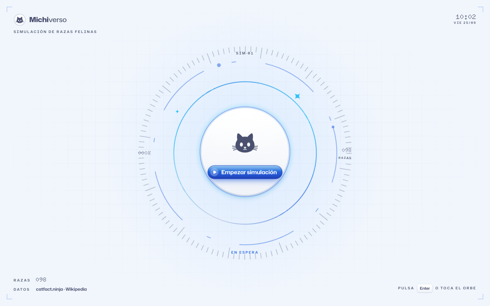 | 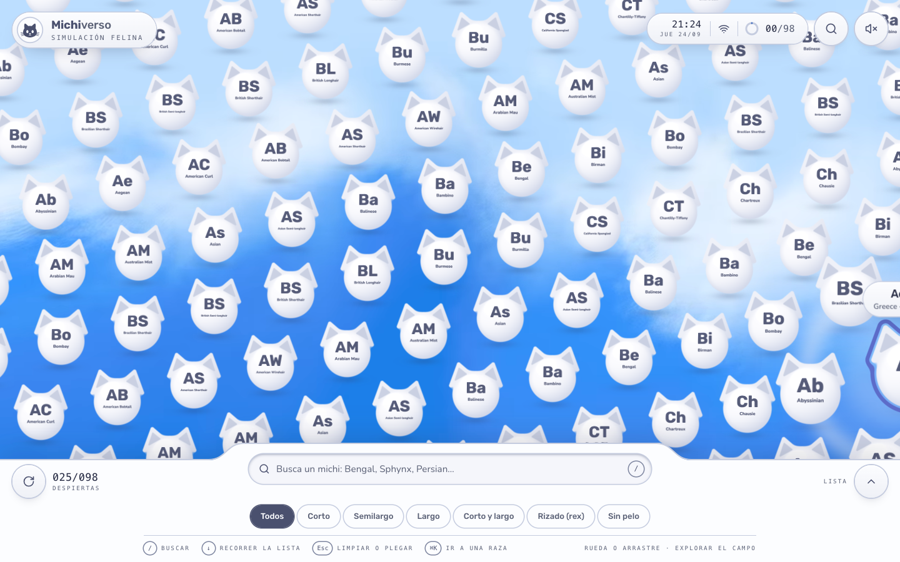 |
| **Ficha** | **Tema oscuro** |
| 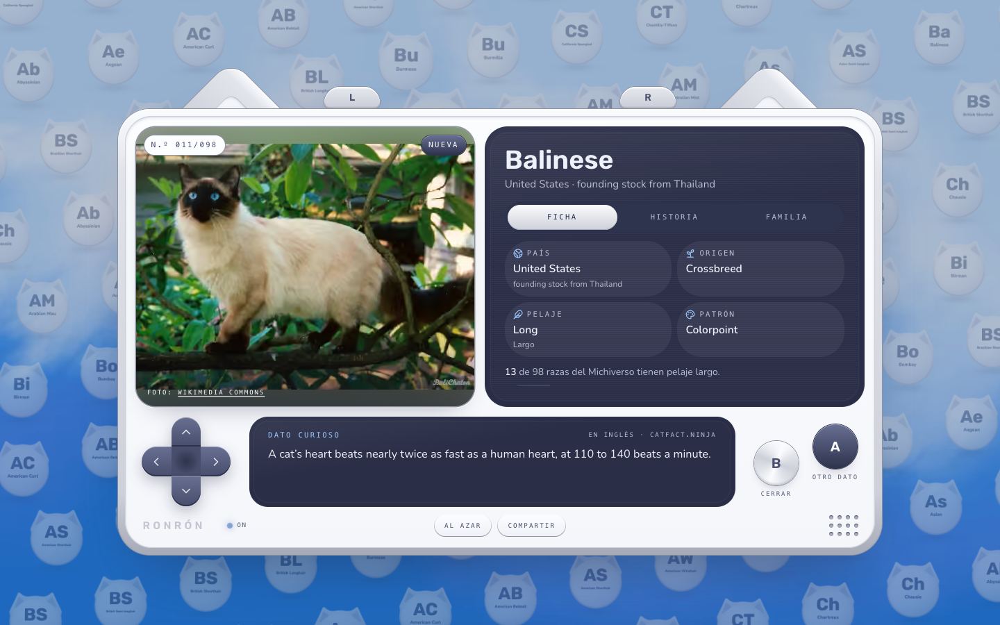 | 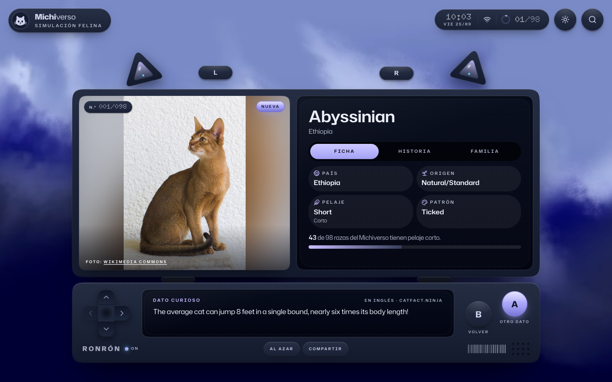 |

## Arrancar el proyecto

Necesitas Node 20.9 o superior.

```bash
git clone https://github.com/Alxrexe/cat-directory-app.git
cd cat-directory-app
npm install
npm run dev
```

Abre http://localhost:3000 y pulsa **Empezar simulación**.

Para juzgar animaciones y rendimiento usa el build de producción. En desarrollo React corre en modo debug y cada ruta se compila la primera vez que la visitas, así que se nota más lento.

```bash
npm run build
npm start
```

No hace falta ninguna variable de entorno. `NEXT_PUBLIC_SITE_URL` es opcional: fija la URL canónica de los metadatos y del sitemap.

| Comando | Qué hace |
| --- | --- |
| `npm test` | 44 pruebas unitarias con Vitest |
| `npm run check` | tipos, lint y pruebas |
| `npm run lighthouse` | audita Home y Detalle contra el servidor en marcha (`RUNS=5` toma la mediana de cinco) |

## Qué pide la prueba y dónde está

| Requisito | Cómo está resuelto |
| --- | --- |
| Raza y país | En la lista de la consola inferior y en cada orbe del campo |
| Infinite scroll | La lista pide la página siguiente a 5 filas del final; en el campo, al recorrer unos 2400 px |
| Recargar | Botón en la consola y gesto de tirar en pantallas táctiles |
| Búsqueda local con debounce | 300 ms, sin distinguir mayúsculas ni acentos, sobre lo que ya está cargado |
| Estado en la URL | `?q=`, `?page=` y `?pelaje=` con `replaceState`; se comparten y sobreviven a un refresh |
| Primer render en servidor | SSR de `/` con la caché de datos de Next; SSG + ISR de las 98 fichas |
| Virtualización | `@tanstack/react-virtual` sobre el contenedor de la lista |
| Detalle | `/razas/[slug]` con breed, country, origin, coat y pattern, más foto y resumen de Wikipedia |
| Dato curioso | `/fact` con su propio estado de carga, independiente de la ficha |
| Estado | React Query para los datos del servidor, Zustand para la UI y la URL para los filtros |
| Errores | Backoff exponencial con jitter (hasta 3 reintentos) antes de avisar; aviso y consultas en pausa sin conexión |
| Tipos y validación | TypeScript estricto y Zod (`zod/mini`) en la frontera con cada API |
| Accesibilidad | Teclado en lista y buscador (`/`, flechas, Enter, Esc) y `aria-*` en la lista virtual y en los estados de carga y error |
| Lighthouse | 90 o más en las cuatro categorías, en Home y Detalle |
| Extras | Tema oscuro con botón (cada visita empieza en claro), transición entre lista y detalle, primera página en localStorage y pruebas |

## Arquitectura

Hexagonal, con las dependencias hacia dentro. Una regla de ESLint (`no-restricted-imports`) rompe el lint si una capa importa de otra más externa.

```
src/
  domain/          entidades y reglas puras: Breed, slug, búsqueda, familias de pelaje
  application/     puertos y casos de uso
  infrastructure/  adaptadores: catfact.ninja, Wikipedia, localStorage y cliente HTTP
  presentation/    React: campo WebGL, consola, ficha y stores
app/               rutas (App Router)
```

- Los componentes piden casos de uso, nunca adaptadores. Las raíces de composición están en `infrastructure/container`: una para el servidor y otra para el navegador, que se descarga la primera vez que hace falta.
- Al abrir una raza desde la Home, la ruta interceptada `@modal/(.)razas/[slug]` la muestra como modal. La URL es la de la ficha y "atrás" la cierra; un enlace directo carga la página completa.
- El campo de orbes es Three.js sin React: un único draw call instanciado, con la paleta y la lupa en el shader.

Hay más detalle en [ARCHITECTURE.md](ARCHITECTURE.md).

## Rendimiento

Build de producción, Lighthouse 13 y mediana de cinco corridas. Los reportes completos están en [`docs/lighthouse/`](docs/lighthouse/).

| Página | Performance | Accessibility | Best Practices | SEO |
| --- | --- | --- | --- | --- |
| Home, móvil | 90 | 100 | 100 | 100 |
| Detalle, móvil | 91 | 100 | 100 | 100 |
| Home, escritorio | 100 | 100 | 100 | 100 |
| Detalle, escritorio | 100 | 100 | 100 | 100 |

| Home, móvil | Detalle, móvil |
| --- | --- |
|  |  |

El margen está en Performance móvil. Lo que más lo movió:

- El motor 3D, GSAP, Zod y los avisos no viajan con la página. El motor se prepara cuando mueves el puntero sobre la pantalla de inicio, así que al pulsar ya está listo.
- Dos fuentes: Hubot Sans sin su eje de anchura (48 KB; con él eran 93) y Doto, 6 KB, para las cifras.
- En la ficha, el video del cielo y el dato curioso esperan al evento `load` para no competir con la foto.
- Las animaciones de la interfaz usan Web Animations sobre `transform` y `opacity`, que corren en el compositor aunque React esté montando una ruta.

Las cifras de móvil dependen de cuánto trabaje el equipo durante la medición: con otras aplicaciones pesadas abiertas bajan dos o tres puntos.

## Decisiones

- La API no expone ids ni un endpoint por raza. El slug sale del nombre y el detalle recorre el listado en el servidor, con cada página cacheada.
- Los textos de la API están en inglés y se muestran tal cual. De los datos curiosos filtro los pocos que no son aptos para toda la familia.
- Siempre se entra por la pantalla de inicio. Cerrar una ficha devuelve directo al campo.
- El sonido no tiene interruptor: es parte de la consola y suena desde la primera pulsación, que es cuando el navegador lo permite.

## Capturas

| | |
| --- | --- |
| 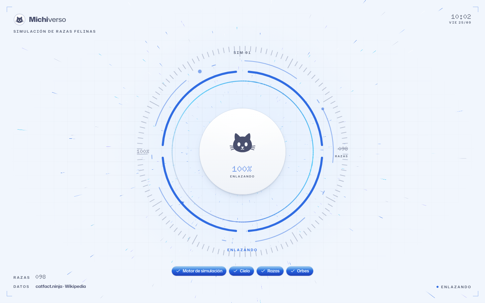 | 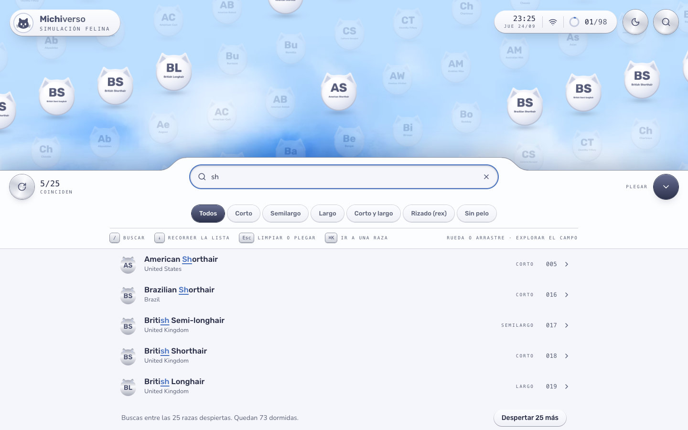 |
| Carga con un arco por paso real | La búsqueda filtra la lista y resalta los orbes |
| 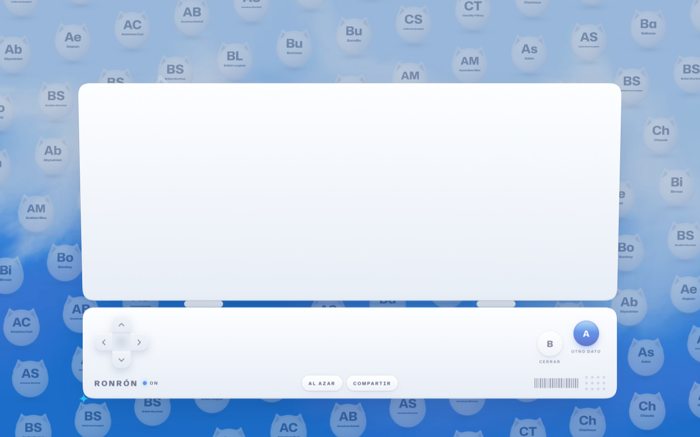 | 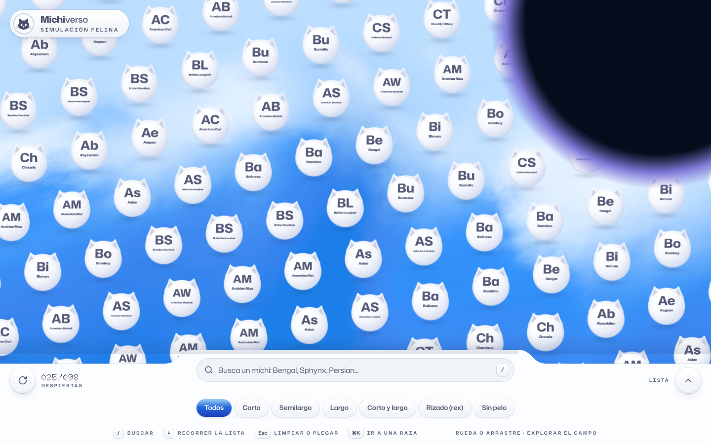 |
| La ficha abre la tapa sobre su bisagra | El cambio de tema nace del botón |
| 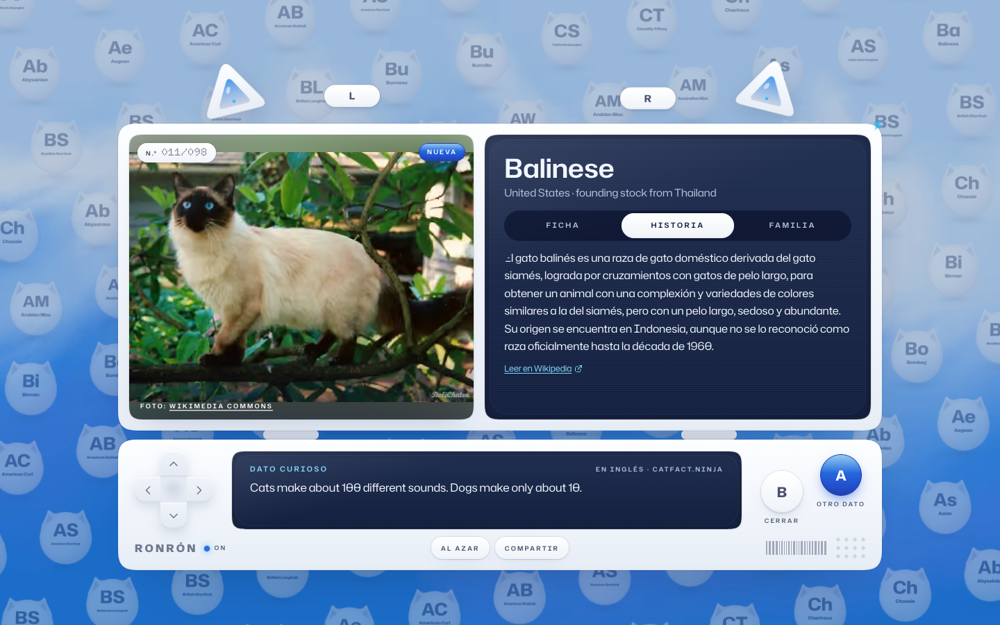 | 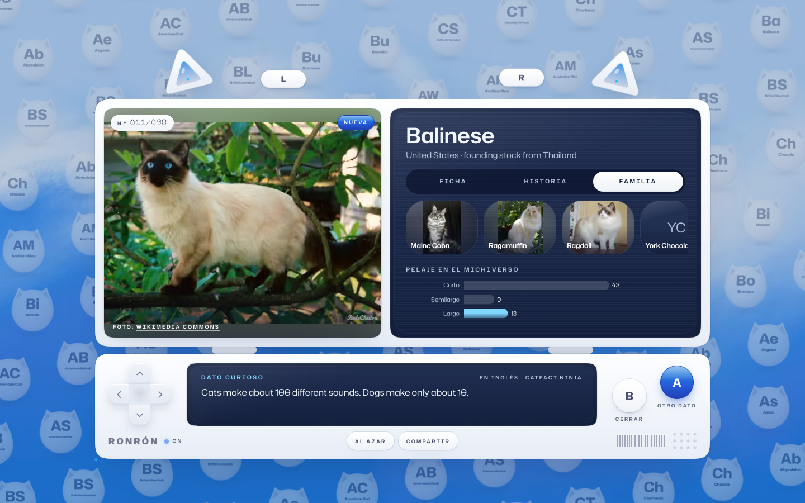 |
| Resumen de Wikipedia | Razas emparentadas y reparto de pelajes |
| 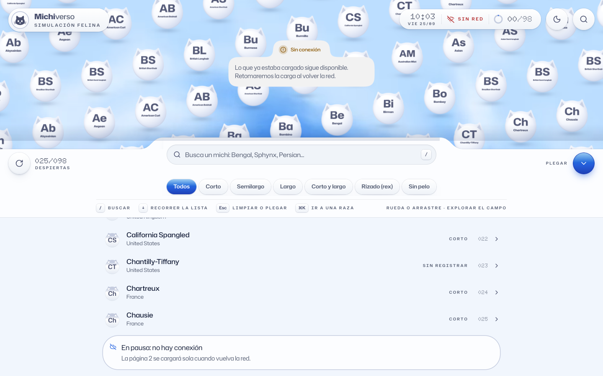 | 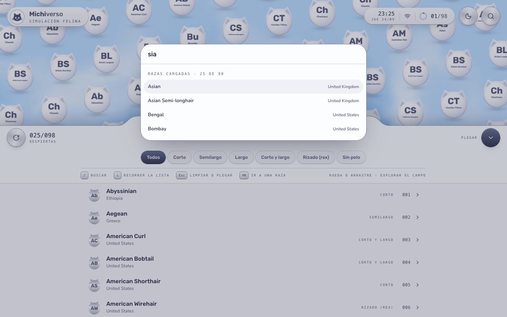 |
| Sin conexión | Salto rápido con ⌘K |

<p>
  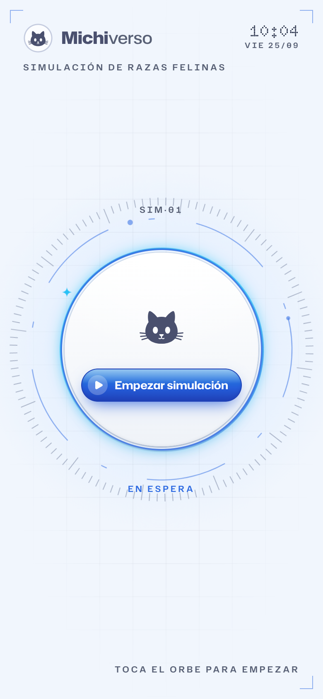
  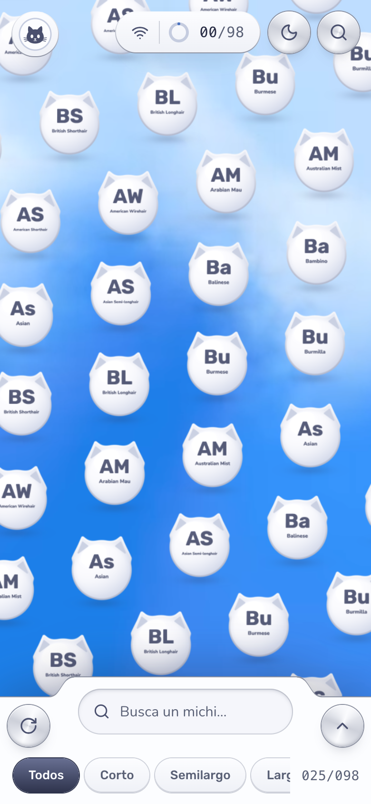
  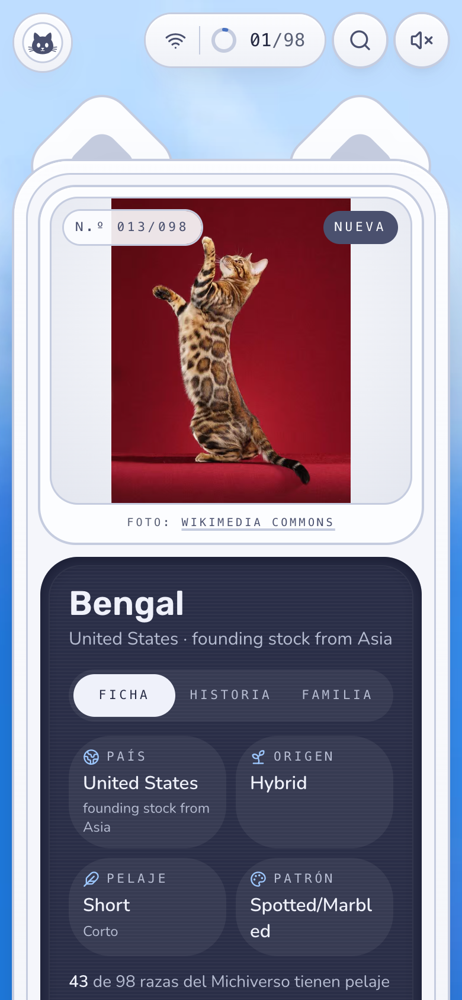
</p>
